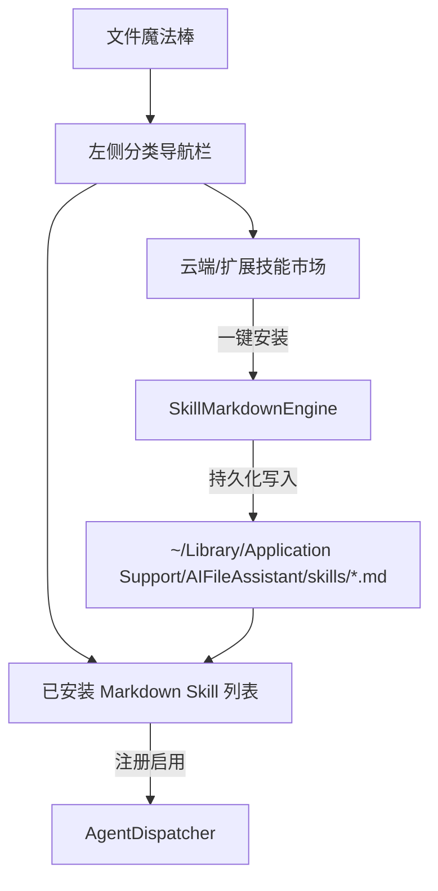

# 文件魔法棒 - Markdown Skill 规范、导航化管理与云端安装实施方案 (Implementation Plan)

## 1. 需求与核心目标

1. **APP 名称统一修改为「文件魔法棒」**：
   - 顶部主标题统一显示为 **「文件魔法棒」**。
2. **首页标题栏清爽化**：
   - 移除标题栏中过于拥挤且易截断的路径面包屑胶囊，将其下沉至文件列表主视图顶部副标题/面包屑。
3. **Skill 管理重构为左侧导航模式**：
   - 移除顶部标题栏中的 Tab 按钮；
   - 采用左侧分类导航栏（全部技能、图片处理、文档与PDF、整理重命名、云端扩展）+ 右侧卡片与市场详情的两栏布局。
4. **基于独立 Markdown 文件的 Skill 架构与云端安装能力**：
   - 每个 Skill 均为独立 `.md` 文件（如 `image_resize.md`、`doc_to_pdf.md`），基于标准 YAML Frontmatter 格式解析与生成；
   - 本地自动同步至 `~/Library/Application Support/AIFileAssistant/skills/*.md`；
   - 提供「云端扩展市场」Tab / 弹窗，支持从云端预设库（视频压缩、OCR 提取、音频转写、表格转换）一键安装，或手动导入 Markdown Skill。

---

## 2. 模块设计与架构流程

---

## 3. 待修改与新增文件清单

1. `Sources/AIFileCore/Engine/SkillMarkdownParser.swift` [NEW]：
   - 解析与序列化带有 YAML Frontmatter 的独立 `.md` Skill 文件。
2. `Sources/AIFileCore/Models/SkillMetadata.swift` [MODIFY]：
   - 增强 Skill 元数据支持 markdown 内容与云端安装来源标识。
3. `Sources/AIFileCore/Engine/SkillManager.swift` [MODIFY]：
   - 实现本地 `.md` 文件加载、保存、从云端安装新 Skill、卸载 Skill。
4. `Sources/AIFileUI/Views/SkillManagementView.swift` [MODIFY]：
   - 重构为左侧分类导航栏 + 右侧已安装/云端市场双模式。
5. `Sources/AIFileUI/Views/MainFloatingPanel.swift` [MODIFY]：
   - APP 名称改为「文件魔法棒」，移除标题栏路径展示，移至列表区上方。
6. `Tests/AIFileCoreTests/SkillMarkdownTests.swift` [NEW]：
   - 单元测试覆盖 Markdown Skill 解析、序列化与云端安装逻辑。
